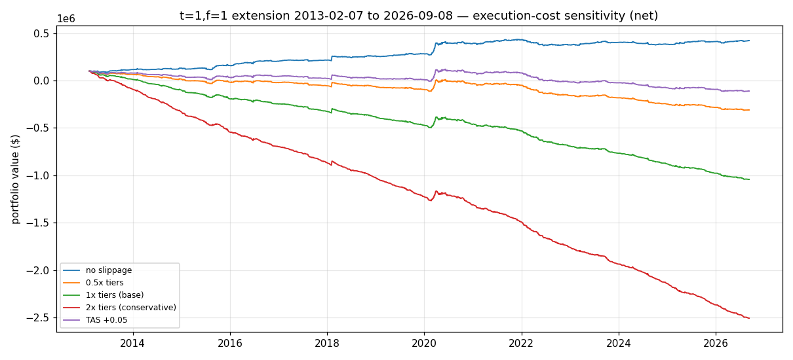
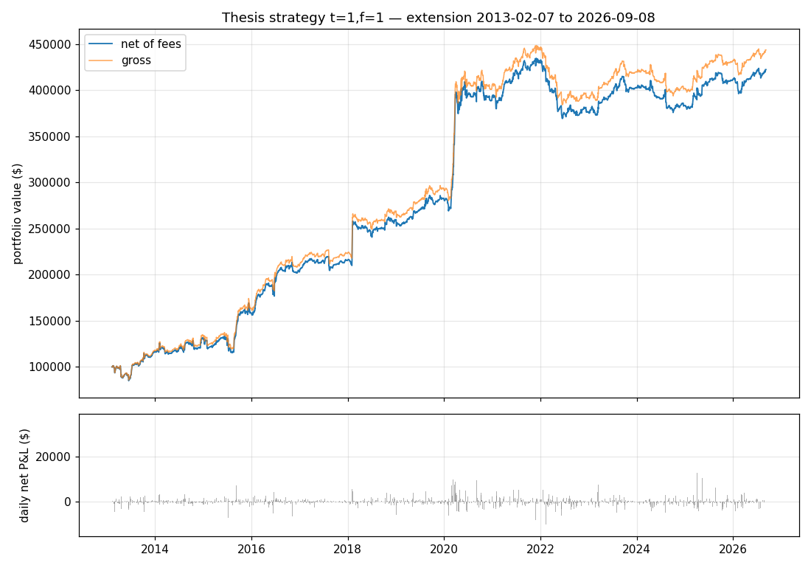

# Extension — 2013-02-07 → 2026-09-08 (out of sample)

The exact t=1, f=1 thesis rules, run forward from the day after the thesis
sample ends. No re-tuning, no parameter changes. 3,419 trading days
(≈13.6 years), 172 listed monthly contracts.

> Educational backtest only — not financial advice, not a live track record.
> Past hypothetical performance does not predict future results.

## Headline — t=1, f=1 (thesis spec), net of fees

| Metric | 2006–2013 (thesis) | 2006–2013 (repro) | **2013–2026 (extension)** |
|---|---|---|---|
| Total return | 249.07% | 290.36% | **322.24%** |
| Annualized return | 19.55% | 21.28% | **11.20%** |
| Annualized volatility | 12.46% | 12.14% | **12.19%** |
| Sharpe (≈1.6% rf) | 1.44 | 1.52 | **0.80** |
| Maximum drawdown | −11.89% | −11.09% | **−16.07%** |
| Winning proportion (daily) | 51.18% | 51.41% | **48.77%** |

Final portfolio value: **$422,242** on $100,000 initial (net); $443,557 gross.
Total fees paid: **$21,314** ($6.23/day, ≈3.1 contracts changed/day).

## How much edge survives realistic slippage? (featured analysis)

The thesis backtest assumes fills at the printed close/settle. VIX futures
closes are volatile and the printed price is often not tradable, so slippage
is now a first-class parameter of the engine (`src/slippage.py`,
`src/backtest.py`: `slip_scale`, `tas_diff`).

**Method.** Adverse slippage per fill (per side), tiered by days-to-maturity
— wider for thin back months. Tiers are the adverse **half-spread** vs the
printed settle (≈ mid):

| DTM bucket | Half-spread (ticks) | $/contract/side |
|---|---|---|
| <60d | 1 (0.05 pts) | $50 |
| 60–120d | 2 (0.10 pts) | $100 |
| 120–210d | 3 (0.15 pts) | $150 |
| >210d | 5 (0.25 pts) | $250 |

> **These tiers are labeled ASSUMPTIONS** — no free public source publishes
> VX bid/ask (two checked, both last-price only). They are placeholders to be
> replaced with measured IBKR paper-trading spreads; the **0.5x / 1x / 2x
> sweep is the real output**, tiers are just the center. The tier table lives
> in `src/slippage.py::SLIPPAGE_TIERS` and can be dropped in without rework.
> Only standard monthly contracts are traded (weeklies excluded at the
> source; volume<10 skip retained; $2/contract fee unchanged).

**Scenarios** (t=1,f=1, both windows): `slip0` (no slippage), `slip0.5x`
(optimistic), `slip1x` (base), `slip2x` (conservative = full spread),
`tas0` / `tas005` (TAS execution, see below).

### Sensitivity table — net of fees AND slippage

Validation (2006–2013):

| Scenario | Total | Ann. | Sharpe¹ | Max DD | Final PV | Slippage paid |
|---|---|---|---|---|---|---|
| slip0 (baseline) | 290.36% | 21.28% | 1.52 | −11.09% | $390,358 | $0 |
| slip0.5x | −73.72% | −17.24% | −0.29 | <−100% | $26,283 | $364,075 |
| slip1x (base) | −437.79% | ruin | n/a | <−100% | −$337,792 | $728,150 |
| slip2x | −1165.94% | ruin | n/a | <−100% | −$1,065,942 | $1,456,300 |
| tas0 | 290.36% | 21.28% | 1.52 | −11.09% | $390,358 | $0 |
| tas005 (+0.05) | 23.81% | 3.07% | 0.19 | −38.10% | $123,808 | $266,550 |

Extension (2013–2026):

| Scenario | Total | Ann. | Sharpe¹ | Max DD | Final PV | Slippage paid |
|---|---|---|---|---|---|---|
| slip0 (baseline) | 322.24% | 11.20% | 0.80 | −16.07% | $422,242 | $0 |
| slip0.5x | −410.43% | ruin | n/a | <−100% | −$310,433 | $732,675 |
| slip1x (base) | −1143.11% | ruin | n/a | <−100% | −$1,043,108 | $1,465,350 |
| slip2x | −2608.46% | ruin | n/a | <−100% | −$2,508,458 | $2,930,700 |
| tas0 | 322.24% | 11.20% | 0.80 | −16.07% | $422,242 | $0 |
| tas005 (+0.05) | −210.61% | ruin | n/a | <−100% | −$110,608 | $532,850 |

¹ Sharpe at ≈1.6%/yr risk-free. "ruin" = total loss beyond −100% under the
fixed ±1-contract sizing (no position scaling/stop — a real account would be
stopped out at zero; annualization is meaningless past ruin).



### Reading the table — the author's instinct was right

- The strategy's **gross edge is ≈$169/day** (validation, ≈$56 per contract
  traded). Its **execution cost is ≈$205/day even at the optimistic 0.5x
  tiers** (≈$71/contract/side), $409/day at the 1x base (≈$142/side), because
  the signal trades the whole curve including wide-spread back months.
  **Costs exceed the edge at every tier multiple — the edge does not survive
  realistic slippage.**
- The only survivable execution is **TAS at exactly the settlement price**
  (`tas0`, identical to no-slippage by construction — verified numerically),
  and even one adverse tick (`tas005`, $50/side) cuts validation to
  +3.07%/yr and ruins the extension.
- This reframes the whole project: the thesis's 20%/yr is a **frictionless
  paper number**. Any live or paper-trading implementation must either
  execute at/near settlement (TAS) or restrict trading to tight-spread
  front months — both are strategy changes to test in Phase 2, not
  assumptions to smuggle into Phase 1.

### TAS (Trade at Settlement) execution scenario

Verified mechanics (CFE Rule 404A/1202(q); CFTC filings): TAS is permitted in
VX; orders must be received by **3:00 p.m. CT** (2:58 p.m. under older rules);
permissible TAS price range **±0.10 index points** around the daily
settlement; minimum TAS increment **0.01 points**; **no TAS in the expiring
contract on its final settlement day**. The backtest fills at the official
daily settlement price — which is exactly what the historical settle series
records, so TAS is the honest answer to "how do I guarantee the closing
price." Variants: settle + 0.00 (optimistic) and settle + 0.05 adverse
(conservative — one outright tick for crossing the TAS spread).

**Caveats, documented:**
1. **Timing approximation (known):** live TAS execution requires signals from
   a **pre-3:00 p.m. CT snapshot**, not the final settle. The backtest
   generates signals from final settles, which is slightly optimistic —
   flagged, not fixed, in Phase 1.
2. **TAS liquidity is thinner than outrights**, especially in back months —
   real position sizes would be capped; the backtest's ±1 contract is small
   enough to be plausible but this needs live verification.
3. The flatten-day-before-expiry rule already keeps the book out of the
   no-TAS final settlement day. ✓

## Did the edge survive? Honest answer: no — not after execution costs

Two separate findings:

1. **Before costs**, the edge decayed into crisis alpha: strong through 2021
   (concentrated in vol events), flat since 2022 (yearly table below).
2. **After realistic execution costs, there is no edge at all** — see the
   slippage analysis above. The strategy's gross edge (≈$169/day,
   ≈$56/contract) is smaller than its execution cost at every tier multiple,
   because the signal trades the whole curve including wide-spread back
   months. The thesis's 20%/yr exists only in a frictionless backtest.

Yearly net returns **before slippage** (for the decay story):

| Year | 2013 | 2014 | 2015 | 2016 | 2017 | 2018 | 2019 | 2020 | 2021 | 2022 | 2023 | 2024 | 2025 | 2026* |
|---|---|---|---|---|---|---|---|---|---|---|---|---|---|---|
| Return | 16% | 12% | 22% | 29% | 5% | 20% | 9% | **40%** | 9% | **−13%** | 7% | −5% | 7% | 3% |

\* 2026 through Sep 8.

- **2013–2021: the edge persisted as crisis alpha** (before costs). Returns
  stayed strongly positive, concentrated in volatility events the model is
  built for:
  Volmageddon (2018-02-05, +$36.5k day), Brexit (2016-06-24, +$15.9k),
  COVID crash (Mar 2020, +$24.7k / +$21.5k days; +40% year).
- **2022–2026: flat** (before costs). Cumulative return over the last ~4.7
  years is roughly zero (−13% in 2022, then treading water). The win rate fell
  below 50%.
- **After costs: negative in every realistic scenario** (above). An edge that
  only pays in crises, decayed in calm markets, *and* is smaller than its own
  execution cost is not a basis for a newsletter track record without a
  fundamentally better execution plan (TAS discipline and/or front-month-only
  trading — Phase 2 work).

## Surprise finding: the "timeliness" result reversed out-of-sample

In the thesis window, slower estimation (t=5, t=10) failed badly. In the
extension, it outperformed:

| Spec (net) | Total | Ann. | Vol | Sharpe¹ | Max DD |
|---|---|---|---|---|---|
| t=1, f=1 (thesis) | 322.24% | 11.20% | 12.19% | 0.80 | −16.07% |
| t=5, f=1 | 446.86% | 13.34% | 17.29% | 0.72 | −25.78% |
| t=5, f=5 | 482.65% | 13.87% | 21.11% | 0.64 | −34.38% |
| t=10, f=1 | 635.93% | 15.85% | 17.33% | 0.84 | −25.27% |
| t=10, f=10 | 675.08% | 16.29% | 19.85% | 0.78 | −34.62% |

The t=10,f=10 gains are broad-based (2014: +46%, 2015: +43%, 2016: +56%,
2018: +31%, 2020: +31%, 2022: +17%), not a single-event artifact — but they
come with much higher volatility and drawdowns. This reversal is consistent
with the decay story: as the market got more efficient at the daily horizon,
the fast signal became noise while slower-moving term-structure premia
persisted. It is an out-of-sample observation, not a recommendation to switch.

## Exposure & turnover — extension, t=1, f=1 (net)

| | Gross exposure | Net exposure | Turnover |
|---|---|---|---|
| Median | 57% | −5% | 0.008% |
| Mean | 65% | −5% | 0.013% |
| p95 | 141% | +25% / −37% (p5) | 0.047% |
| Max | 208% | +141% / −113% | 0.116% |

The strategy remains roughly market-neutral (median net exposure ≈ −5%) with
gross exposure usually below 100% and spikes above 200% only in crises.

## Files

- `results/stats_extension.json` — full statistics (all specs, gross & net)
- `results/daily_extension_{t1_f1,t5_f1,t5_f5,t10_f1,t10_f10}.csv` — daily ledger
- `results/equity_extension_t1_f1.png` — equity curve (chart below)
- `results/extension_exposure.json` — exposure/turnover summary
- `results/stats_slippage.json` — t=1,f=1 execution-cost sensitivity (both windows)
- `results/daily_slippage_{validation,extension}_{slip0,slip0.5x,slip1x,slip2x,tas0,tas005}.csv`
- `results/equity_slippage_extension.png` — execution-cost overlay chart (above)
- `src/slippage.py` — tier table (ASSUMPTION) + drop-in structure

## Reproduce

```bash
cd ~/workspace/vol-strategy
python3 run_backtest.py --skip-panel --only extension   # thesis-frictionless
python3 run_backtest.py --skip-panel --only slippage   # execution-cost sweep
```


