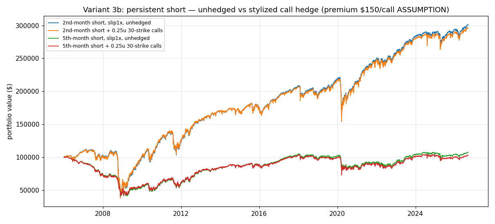

# Phase 2, variant 3b — Persistent short + stylized call hedge

> Educational backtest only — not financial advice, not a live track record.
> Past hypothetical performance does not predict future results. Short
> volatility strategies have severe, historically realized tail risk.

## (a) Unhedged persistent short — design (documented)

Hold a constant **−1 contract** short in a fixed maturity slot; **roll only
on expiry approach** — no daily signal, no model. Two sub-variants:

| Variant | Holds | Rolls when |
|---|---|---|
| `second_month` | 2nd listed monthly | held dtm ≤ 5 (5 days before expiry) or untradable |
| `month5` | 5th listed monthly (≈4–6 month zone) | held dtm ≤ 90 or untradable |

Engine: `run_persistent_short` (`src/short_back.py`). Window 2006-01-03 →
2026-09-08, $100k start, $2/contract fees, same 6 execution scenarios.
Because the only trades are rolls (+ initial entry), the ledger's
`fees`/`slippage` **are** the roll costs, reported separately from daily
mark-to-market (`pl_gross`).

## (a) Results — persistent short, net

**second_month** (251 rolls, 12.1/yr):

| Scenario | CAGR | Sharpe¹ | Max DD | Worst month | Final PV | Roll slippage | Roll fees | MTM P&L |
|---|---|---|---|---|---|---|---|---|
| slip0 | 5.90% | 0.34 | −62.97% | 2008-10: −38.1% | $326,339 | $0 | $994 | $227,333 |
| slip0.5x | 5.70% | 0.32 | −64.44% | 2008-10: −38.9% | $313,714 | $12,625 | $994 | $227,333 |
| slip1x | 5.49% | 0.30 | −65.94% | 2008-10: −39.7% | $301,089 | $25,250 | $994 | $227,333 |
| slip2x | 5.04% | 0.27 | −69.01% | 2008-10: −41.4% | $275,839 | $50,500 | $994 | $227,333 |
| tas005 | 5.50% | 0.30 | −65.70% | 2008-10: −39.5% | $301,489 | $24,850 | $994 | $227,333 |

**month5** (196 rolls, 9.5/yr):

| Scenario | CAGR | Sharpe¹ | Max DD | Worst month | Final PV | Roll slippage | Roll fees | MTM P&L |
|---|---|---|---|---|---|---|---|---|
| slip0 | 2.35% | 0.13 | −37.72% | 2008-10: −14.7% | $161,396 | $0 | $774 | $62,170 |
| slip0.5x | 1.44% | 0.04 | −46.86% | 2008-10: −17.2% | $134,396 | $27,000 | $774 | $62,170 |
| slip1x | 0.35% | −0.03 | −59.49% | 2008-10: −20.7% | $107,396 | $54,000 | $774 | $62,170 |
| slip2x | −3.00% | −0.01 | −86.17% | 2008-10: −34.2% | $53,396 | $108,000 | $774 | $62,170 |
| tas005 | 1.72% | 0.06 | −42.69% | 2008-10: −16.2% | $142,046 | $19,350 | $774 | $62,170 |

¹ Sharpe at ≈1.6%/yr risk-free.

**Reading it:** the second-month persistent short is the same animal as the
Task 3 front benchmark (5.49% vs 5.82% CAGR at 1x) — front carry survives
costs because rolls are monthly in the 1-tick bucket ($25k total slippage
over 20.7 years vs $227k MTM gains). The month5 variant earns only $62k MTM
over 20.7 years and its $54k roll slippage at 1x nearly erases it (+0.35%
CAGR) — the same "edge lives in wide-spread tenors" problem as Task 3.

**Tail risk / margin implication (1 contract on $100k):**

| | second_month | month5 |
|---|---|---|
| Max drawdown | −65.94% (−$65.9k adverse excursion) | −59.49% |
| Worst month | 2008-10: −39.7% (−$39.7k) | 2008-10: −20.7% |
| Worst day | 2018-02-05: −$17,600 (−9.4% of equity) | 2020-03-18: −$7,600 (−10.1%) |
| 2008 episode (Sep–Dec) | −42.6% (DD −64.9%) | −30.5% (DD −42.6%) |
| Volmageddon 2018 | −6.8% | −4.7% |
| COVID (Feb–Apr 2020) | −14.5% (DD −29.0%) | −16.1% (DD −26.6%) |

Implication: a $100k account running 1 contract mechanically survives in
this accounting, but the adverse excursion reaches two-thirds of equity and
Oct-2008's pace (−$40k in a month, −$17.6k single days) means any account
under ~$75k per contract — or any position larger than 1 contract per
~$150k equity — faces margin calls in a 2008-type episode. Exchange margins
vary; check live CFE requirements before sizing. This is not passive income.

## (b) Hedge — design sketch

**Proposed design:** rolling **3-month 30-strike VIX calls**, 0.25–0.5 units
per short future, bought as a monthly ladder (first trading day of each
month), each lot held to expiry. VIX options have a **$100 multiplier**
(vs $1000 for futures), so 0.25 units = $25 per VIX point of convexity.

**Data needed to price it properly:** daily VIX options closes
2006–2026 (CBOE DataShop or ORATS — both paid). **No free long-history
source exists** (checked: Barchart free history covers ~2 years and is
paywalled beyond that). So the backtest below is **stylized**:

- **ASSUMPTION:** fixed premium per call — swept at $75 / $150 / $300
  (real 3m-30-strike premia vary with vol-of-vol; $150/call ≈ 1.5 VIX
  points, a mid-case guess).
- Expiry payoff = units × $100 × max(0, spot VIX at expiry − 30), using the
  panel's daily spot VIX close as the settlement proxy (approximation —
  real settlement is the AM VRO print).

## (b) Stylized hedge results (applied to the slip1x baseline)

| Variant / hedge | CAGR | Sharpe | Max DD | Premium paid (20.7y) | Payoff (20.7y) |
|---|---|---|---|---|---|
| second_month unhedged | 5.49% | 0.30 | −65.94% | — | — |
| + 0.25u @ $75 | 5.49% | 0.31 | −65.50% | $4,669 | $4,952 |
| + 0.25u @ $150 | 5.42% | 0.30 | −66.00% | $9,338 | $4,952 |
| + 0.25u @ $300 | 5.25% | 0.29 | −67.03% | $18,675 | $4,952 |
| + 0.5u @ $150 | 5.34% | 0.30 | −66.07% | $18,675 | $9,904 |
| month5 unhedged | 0.35% | −0.03 | −59.49% | — | — |
| + 0.25u @ $150 | 0.15% | −0.04 | −59.72% | $9,338 | $4,952 |

Payoffs arrived only in 22 of 249 lots (2008–09, 2010, 2011, 2020, 2022):
the calls did fire in crises (e.g., $823 in Oct 2008, $523 on Apr 2 2020),
but **the hedge does not fix the drawdown** — Oct 2008 went from −39.7% to
−39.3% hedged. Reason: the persistent short's losses come from the futures
curve *rising and staying elevated for weeks* (sustained backwardation),
not from a single VIX print above 30 at option expiry; the payoff arrives
too late and too small, while the premium is paid every month. At $150+/call
the hedge costs more than it ever pays back ($9.3k premium vs $5.0k payoff
over 20.7 years); only the likely-unrealistic $75 premium breaks even.
**Honest verdict:** this tail hedge, as specified, is an expensive placebo
against the actual loss mechanism. A real hedge would need to address the
sustained-curve-rise regime (e.g., futures-based stop/roll rules or
shorter-dated, closer-strike options) — and priced with real options data.

## Files

- `results/phase2_3b_persistent_stats.json` — per-scenario stats incl.
  n_rolls, rolls/yr, roll slippage/fees, MTM P&L, worst month/day, episodes
- `results/phase2_3b_persistent_daily_{second_month,month5}_{slip0,slip0.5x,slip1x,slip2x,tas0,tas005}.csv`
  (includes `roll_event` flags)
- `results/phase2_3b_hedge_stats.json`, `results/phase2_3b_hedge_daily_{second_month,month5}_u{0.25,0.5}_p{75,150,300}.csv`
- `results/phase2_3b_equity.png`
- Reproduce: `python3 run_phase2b.py`
