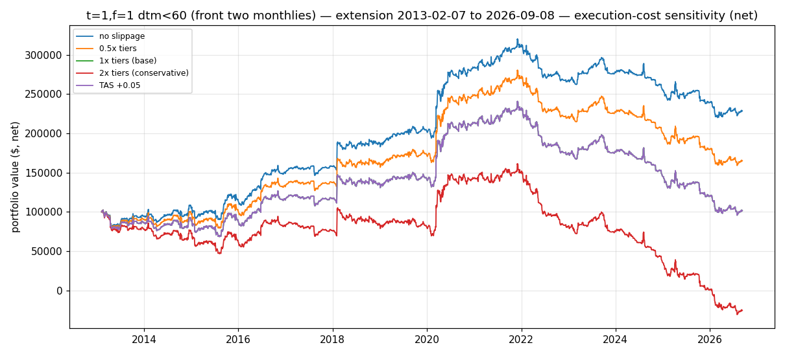

# Phase 2, Task 1 — Front-month-only t=1,f=1

> Educational backtest only — not financial advice, not a live track record.
> Past hypothetical performance does not predict future results.

## Design choice (documented)

**Tradable universe: contracts with DTM < 60 days** — i.e., the front two
standard monthlies. Rationale:

1. It is exactly the tier-1 slippage bucket (1 tick / $50 per contract per
   side, the cheapest assumption in `src/slippage.py`).
2. It is where the liquidity is: 2025 median daily volume was ~82k contracts
   for DTM<60 vs ~13k (60–120d), ~3k (120–210d), ~75 (>210d).
3. Estimation (A, B) still uses the full-curve cross-section (thesis
   calibration); only *position-taking* is restricted. The flatten-day-before-
   expiry rule is unchanged (computed on the full curve).

Parameter: `run_backtest(..., max_dtm=60)` (`src/backtest.py`). Six execution
scenarios × two windows, same as Phase 1.

## Results — t=1,f=1, DTM<60, net of fees AND slippage

Validation (2006-01-03 → 2013-02-06):

| Scenario | Total | Ann. | Sharpe¹ | Max DD | Final PV | Slippage paid |
|---|---|---|---|---|---|---|
| slip0 | 201.69% | 16.93% | 1.09 | −18.73% | $301,694 | $0 |
| slip0.5x | 165.99% | 14.86% | 0.88 | −21.16% | $265,994 | $35,700 |
| slip1x (base) | 130.29% | 12.54% | 0.68 | −24.09% | $230,294 | $71,400 |
| slip2x | 58.89% | 6.78% | 0.33 | −42.81% | $158,894 | $142,800 |
| tas0 | 201.69% | 16.93% | 1.09 | −18.73% | $301,694 | $0 |
| tas005 (+0.05) | 130.29% | 12.54% | 0.68 | −24.09% | $230,294 | $71,400 |

Extension (2013-02-07 → 2026-09-08):

| Scenario | Total | Ann. | Sharpe¹ | Max DD | Final PV | Slippage paid |
|---|---|---|---|---|---|---|
| slip0 | 128.50% | 6.28% | 0.41 | −31.26% | $228,503 | $0 |
| slip0.5x | 65.05% | 3.76% | 0.21 | −43.30% | $165,053 | $63,450 |
| slip1x (base) | 1.60% | 0.12% | 0.00 | −60.22% | $101,603 | $126,900 |
| slip2x | −125.30% | ruin | n/a | −119.08% | −$25,297 | $253,800 |
| tas0 | 128.50% | 6.28% | 0.41 | −31.26% | $228,503 | $0 |
| tas005 (+0.05) | 1.60% | 0.12% | 0.00 | −60.22% | $101,603 | $126,900 |

¹ Sharpe at ≈1.6%/yr risk-free.

## Reading the table — verdict: costs become survivable, but the edge is gone

**What restricting to the front fixes.** Compare with the whole-curve Phase 1
sweep at the base 1x tier: validation went from **ruin → +12.54%/yr**
(Sharpe 0.68); extension went from **ruin → +0.12%/yr** (breakeven). No ruin
at any tier ≤ 1x in either window. Execution cost fell from ~$409/day
(whole curve) to ~$37/day (front only, extension, 1x) because rolls and
signals no longer touch the 2–5-tick back-month tiers. Fees are trivial:
$2,856 over 7.1 years (validation), $5,076 over 13.6 years (extension) —
≈$1.5/day.

**What it doesn't fix.** The frictionless edge itself decayed: front-only
slip0 is 16.93%/yr in validation but only 6.28%/yr (Sharpe 0.41) in the
extension — and the whole-curve thesis number (21.28%/1.52) shows the front
two monthlies captured ~80% of the original gross edge, so little was
sacrificed by the restriction. After realistic costs the extension is
economically zero: +0.12%/yr at 1x tiers (or TAS+0.05) with a **−60% maximum
drawdown**, +3.76%/yr at the optimistic 0.5x tiers. Gross edge ≈ $76/day vs
execution cost ≈ $39/day at 1x — the margin is a rounding error, not a
business.

**Bottom line:** front-month-only converts certain ruin into *survivable
breakeven*. It answers Miao's question — yes, the cost problem is fixed by
dropping the wide back months — but it exposes the deeper problem: the
remaining gross edge in 2013–2026 is too small and too decayed (see
`phase2_decay.md`) to support a track record. Not viable as a standalone
strategy; useful only as a cost-controlled vehicle *if* a better signal is
found.

## Files

- `results/phase2_front_dtm60_stats.json` — full statistics
- `results/phase2_front_dtm60_daily_{validation,extension}_{slip0,slip0.5x,slip1x,slip2x,tas0,tas005}.csv`
- `results/phase2_front_dtm60_exposure_{validation,extension}.json`
- `results/phase2_front_equity.png`
- Reproduce: `python3 phase2_finish.py` (Task 1 portion) or
  `python3 run_phase2.py --only front`
