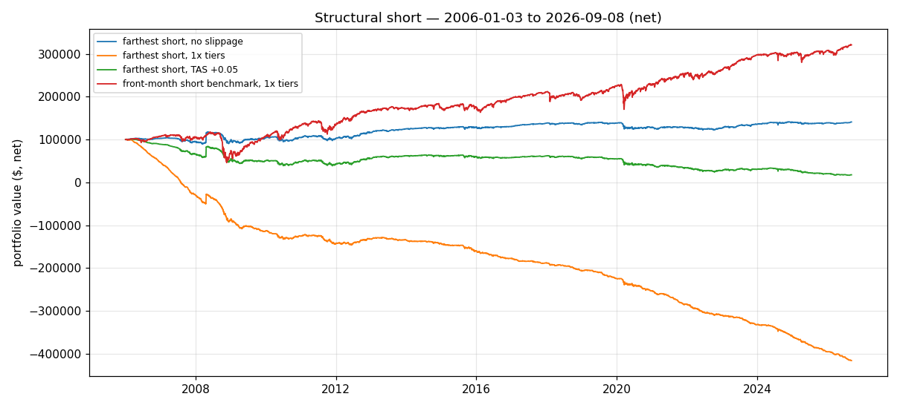

# Phase 2, Task 3 — Structural short back-month

> Educational backtest only — not financial advice, not a live track record.
> Past hypothetical performance does not predict future results. Short
> volatility strategies have severe, historically realized tail risk —
> documented below, not downplayed.

## Design choices (documented)

Instead of model-driven long/short, hold a **permanent −1 contract short**,
re-selected at each close, 2006-01-03 → 2026-09-08, $100k start, $2/contract
fees, same slippage tiers/TAS convention as Phase 1. Three universes:

| Universe | Definition |
|---|---|
| `farthest` | Farthest listed standard monthly with volume ≥ 10 at the decision close |
| `farthest_sticky` | Same target, but **sticky**: keep the current contract while it stays tradable (vol ≥ 10) and a back month (dtm ≥ 120); otherwise roll to the farthest tradable. The realistic implementation of "always short the back month" |
| `dtm120` | Nearest contract with dtm > 120 and volume ≥ 10 (fixed-tenor definition) |
| `front` | Nearest contract — included only as the conventional short-carry benchmark, not a proposal |

Engine: `src/short_back.py`. The naive `farthest` re-selects daily; the
volume filter flickers, producing a target change every **4.2 days** (1,236
rolls) — an unrealistic churn artifact. `farthest_sticky` rolls every
**~25 days** (211 rolls, avg held dtm 177) and is the honest version; both
are reported.

## Results — full window, net of fees AND slippage

Farthest, sticky (realistic rolls):

| Scenario | Total | Ann. | Sharpe¹ | Max DD | Final PV | Slippage paid |
|---|---|---|---|---|---|---|
| slip0 | 43.06% | 1.75% | 0.06 | −34.50% | $143,058 | $0 |
| slip0.5x | 6.06% | 0.29% | −0.06 | −55.53% | $106,059 | $37,000 |
| slip1x (base) | −30.94% | −1.78% | −0.07 | −80.34% | $69,058 | $74,000 |
| slip2x | −104.94% | ruin | n/a | −133.23% | −$4,942 | $148,000 |
| tas0 | 43.06% | 1.75% | 0.06 | −34.50% | $143,058 | $0 |
| tas005 (+0.05) | 21.91% | 0.97% | −0.02 | −45.23% | $121,909 | $21,150 |

dtm120 (slip1x): −72.39% total (−6.05%/yr), max DD −89.97%. tas005: +7.61%.
Naive farthest (churn): ruin at every tier ≥ 0.5x.

Front-month short benchmark (slip1x): **+220.91% total, 5.82%/yr, Sharpe
0.32, max DD −60.94%** — costs barely dent it ($25,650 slippage over 20.7
years; rolls are monthly in the 1-tick bucket).

¹ Sharpe at ≈1.6%/yr risk-free.

## Verdict: the structural back-month short is not viable

The arithmetic is brutal and simple. The farthest short's **gross edge is
≈$8.7/day** (the variance-risk-premium / contango roll-down is real but
tiny at 1-contract scale), while rolling a back-month contract costs
**≈$14/day at the base 1x tier** ($250/contract/side in the >210d bucket).
Costs exceed the edge at every realistic tier — only the optimistic 0.5x
(+0.29%/yr, economically zero) or TAS+0.05 (+0.97%/yr) survive, both with
40–55% drawdowns. The dtm120 variant fails the same way. This is the mirror
image of the thesis strategy's problem: the edge lives in the wide-spread
tenors, and the spread eats it.

The surprise is the **front-month short benchmark**: +5.82%/yr after full
1x costs, because its edge (≈$48/day gross) dwarfs its $5/day roll costs.
But "survives costs" ≠ "viable":

## Tail risk — shown honestly

Front short (slip1x), $100k start, 1 contract:

- **2008 crisis: −38%** (Sep–Dec), window max drawdown **−60%**
- **COVID (Feb 20–Apr 30, 2020): −10.3%**, window max DD −24.9%; worst
  single day **−$19,200 (Mar 16, 2020)** — ~10% of equity in one day,
  holding the front contract into expiry week (dtm=2)
- **Volmageddon (2018): −5.7%**; worst day −$17,600 (Feb 5, 2018)
- **Aug 5, 2024 vol spike: −$10,246 in a day**
- Full-sample max DD −60.94%; yearly returns include 2008: −32.4%

Farthest sticky (slip1x): 2008: **−51.6%**; COVID window −17.3%
(DD −21.3%); worst days −$5,100 (Jun 11, 2020), −$4,864 (Dec 1, 2008),
−$3,975 (Mar 16, 2020), −$3,950 (Feb 5, 2018 — Volmageddon).

A short-vol position is picking up pennies in front of a steamroller that
arrives on schedule: 2008, 2018, 2020, and 2024 all appear in the worst-day
list. No position sizing, stop, or margin modeling is included here — a
real account would face margin calls long before the backtest's accounting
"ruin." This must not be presented as passive income.

## Bottom line

- **Back-month structural short (either definition): dead under realistic
  costs.** Gross carry ≈ $8–9/day can't clear back-month spreads. Not viable.
- **Front-month structural short: survives costs (+5.8%/yr at 1x) but is a
  classic short-vol tail-risk trade** — −60% drawdown, −$19k single days,
  no crisis hedge. It is a different risk animal than the thesis strategy,
  not a fix for it.
- Neither rescues the newsletter thesis; the front short is at best a
  benchmark for what "harvesting carry" actually costs in risk terms.

## Files

- `results/phase2_short_stats.json` (farthest / dtm120 / front),
  `results/phase2_short_stats_sticky.json` (farthest_sticky)
- `results/phase2_short_daily_{farthest,farthest_sticky,dtm120,front}_{slip0,slip0.5x,slip1x,slip2x,tas0,tas005}.csv`
- `results/phase2_short_equity.png`
- Reproduce: `python3 run_phase2.py --only short` (+ sticky block in the
  Task 3 verification command — see `phase2_finish.py`)
